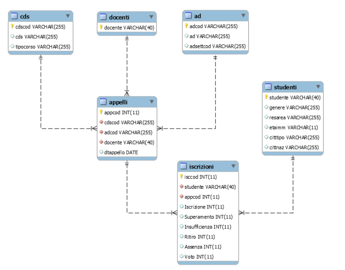

# Bicocca Open Stats

Homework per il corso di _Business Intelligence_. Si richiede di:

- Scrivere query SQL per ciascuna delle 6+1 domande richieste. Ogni domanda deve essere 
svolta utilizzando sia il modello relazione denormalizzato sia quello normalizzato.
- Commentare il risultato ottenuto e le _differenze_ riscontrate nel calcolo della query 
nell’uno e nell’altro modello.
- Produrre della documentazione riguardante il progetto svolto.
- Opzionalmente produrre un cruscotto per la visualizzazione grafica dei risultati ottenuti.

## Dati
I dati a disposizione descrivono la didattica in università in particolare:

- _Anagrafiche didattiche_: attività didattiche, corsi di studio, docenti
- _Anagrafica studente_: genere, età, residenza, cittadinanza
- _Appello_: attività didattica, corso di studio, docente, data dell’appello
- _Iscrizione_: appello e studente iscritto
- _Esito_: appello, studente, esito (superato, insufficienza, ritiro, assenza, voto)

Oltre al modello relazionale è fornito anche una tabella denormalizzata che contiene tutti i dati.

## Query
Si richiede di svolgere sei query date più una settima a scelta su entrambi i modelli, 
normalizzato e denormalizzato:

1. _who is playing?_: Distribuzione del numero degli studenti iscritti nei vari appelli, 
suddivisa per anni e per corso di laurea.
2. _I’ll never graduate_: Individuazione della Top-10 degli esami più difficili suddivisi 
per corso di studi. Per esame più difficile si intende l’esame che presenta il tasso di superamento
complessivo minore, considerando tutti gli appelli dell’Anno Accademico. Tasso di superamento è 
inteso come "numero di studenti che hanno superato l’appello" su "numero di studenti che hanno 
partecipato all’appello".
3. _Commitment_: Individuazione dei corsi di laurea ad elevato tasso di commitment, 
ovvero appelli di esami diversi ma del medesimo corso di laurea che si sono svolti 
nello stesso giorno.
4. _hardest/easiest exams_: Individuazione della Top-3 degli esami con media voti maggiore e 
minore rispettivamente, calcolati per ogni singolo corso di studi.
5. _Fast & Furious_: Calcolare la distribuzione degli studenti _fast & furious_ per corso di studi, 
ovvero studenti con il rapporto "votazione media riportata negli esami superati" su "periodo
di attività" maggiore. Per periodo di attività si intende il numero di giorni trascorsi tra il
primo appello sostenuto (non necessariamente superato) e l’ultimo.
6. _Trial & Error_: Individuazione della Top-3 degli esami _trial & error_, ovvero esami che 
richiedono il maggior numero di tentativi prima del superamento. Dato uno corso di studi, il
rispettivo valore _trial & error_ è dato dalla media del numero di tentativi (bocciature) 
di ogni studente per ogni appello del corso.
7. Una domanda a piacimento.